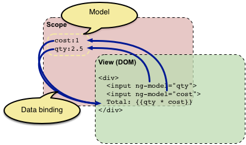

# Conceptual Overview

## Data binding

In the following example we will build a form to calculate the costs of an invoice in different currencies.

Let's start with input fields for quantity and cost whose values are multiplied to produce the total of the invoice:

	

	  <b>Invoice:</b>
	  

	    Quantity: <input type="number" min="0" ng-model="qty">
	  

	  

	    Costs: <input type="number" min="0" ng-model="cost">
	  

	  

	    <b>Total:</b> {{qty * cost | currency}}
	  

	

	
Try out the Live Preview above, and then let's walk through the example and describe what's going on.

This looks like normal HTML, with some new markup. In AngularJS, a file like this is called a template. When AngularJS starts your application, it parses and processes this new markup from the template using the compiler. The loaded, transformed and rendered DOM is then called the view.

The first kind of new markup are the directives. They apply special behavior to attributes or elements in the HTML. In the example above we use the ng-app attribute, which is linked to a directive that automatically initializes our application. AngularJS also defines a directive for the input element that adds extra behavior to the element. The ng-model directive stores/updates the value of the input field into/from a variable.

Custom directives to access the DOM: In AngularJS, the only place where an application should access the DOM is within directives. This is important because artifacts that access the DOM are hard to test. If you need to access the DOM directly you should write a custom directive for this. The directives guide explains how to do this.

The second kind of new markup are the double curly braces {{ expression | filter }}: When the compiler encounters this markup, it will replace it with the evaluated value of the markup. An expression in a template is a JavaScript-like code snippet that allows AngularJS to read and write variables. Note that those variables are not global variables. Just like variables in a JavaScript function live in a scope, AngularJS provides a scope for the variables accessible to expressions. The values that are stored in variables on the scope are referred to as the model in the rest of the documentation. Applied to the example above, the markup directs AngularJS to "take the data we got from the input widgets and multiply them together".

The example above also contains a filter. A filter formats the value of an expression for display to the user. In the example above, the filter currency formats a number into an output that looks like money.

The important thing in the example is that AngularJS provides live bindings: Whenever the input values change, the value of the expressions are automatically recalculated and the DOM is updated with their values. The concept behind this is two-way data binding.

## Adding UI logic: Controllers

Let's add some more logic to the example that allows us to enter and calculate the costs in different currencies and also pay the invoice.

	mblowfish.controller('InvoiceController', function InvoiceController() {
	  this.qty = 1;
	  this.cost = 2;
	  this.inCurr = 'EUR';
	  this.currencies = ['USD', 'EUR', 'CNY'];
	  this.usdToForeignRates = {
	    USD: 1,
	    EUR: 0.74,
	    CNY: 6.09
	  };
	
	  this.total = function total(outCurr) {
	    return this.convertCurrency(this.qty * this.cost, this.inCurr, outCurr);
	  };
	  this.convertCurrency = function convertCurrency(amount, inCurr, outCurr) {
	    return amount * this.usdToForeignRates[outCurr] / this.usdToForeignRates[inCurr];
	  };
	  this.pay = function pay() {
	    window.alert('Thanks!');
	  };
	});

The template is:

	

	  <b>Invoice:</b>
	  

	    Quantity: <input type="number" min="0" ng-model="invoice.qty" required >
	  

	  

	    Costs: <input type="number" min="0" mb-model="invoice.cost" required >
	    <select mb-model="invoice.inCurr">
	      <option mb-repeat="c in invoice.currencies">{{c}}</option>
	    </select>
	  

	  

	    <b>Total:</b>
	    
	      {{invoice.total(c) | currency:c}}
	     
	    <button class="btn" mb-click="invoice.pay()">Pay</button>
	  

	

What changed?

First, there is a new JavaScript file that contains a controller. More accurately, the file specifies a constructor function that will be used to create the actual controller instance. The purpose of controllers is to expose variables and functionality to expressions and directives.

Besides the new file that contains the controller code, we also added an ng-controller directive to the HTML. This directive tells AngularJS that the new InvoiceController is responsible for the element with the directive and all of the element's children. The syntax InvoiceController as invoice tells AngularJS to instantiate the controller and save it in the variable invoice in the current scope.

We also changed all expressions in the page to read and write variables within that controller instance by prefixing them with invoice. . The possible currencies are defined in the controller and added to the template using ng-repeat. As the controller contains a total function we are also able to bind the result of that function to the DOM using {{ invoice.total(...) }}.

Again, this binding is live, i.e. the DOM will be automatically updated whenever the result of the function changes. The button to pay the invoice uses the directive ngClick. This will evaluate the corresponding expression whenever the button is clicked.

In the new JavaScript file we are also creating a module at which we register the controller. We will talk about modules in the next section.

The following graphic shows how everything works together after we introduced the controller:

## View-independent business logic: Services

Right now, the InvoiceController contains all logic of our example. When the application grows it is a good practice to move view-independent logic from the controller into a service, so it can be reused by other parts of the application as well. Later on, we could also change that service to load the exchange rates from the web, e.g. by calling the exchangeratesapi.io exchange rate API, without changing the controller.

Let's refactor our example and move the currency conversion into a service in another file:

	mblowfish.factory('currencyConverter', function() {
	  var currencies = ['USD', 'EUR', 'CNY'];
	  var usdToForeignRates = {
	    USD: 1,
	    EUR: 0.74,
	    CNY: 6.09
	  };
	  var convert = function(amount, inCurr, outCurr) {
	    return amount * usdToForeignRates[outCurr] / usdToForeignRates[inCurr];
	  };
	
	  return {
	    currencies: currencies,
	    convert: convert
	  };
	});
	

	mblowfish.controller('InvoiceController', ['currencyConverter', function InvoiceController(currencyConverter) {
	  this.qty = 1;
	  this.cost = 2;
	  this.inCurr = 'EUR';
	  this.currencies = currencyConverter.currencies;
	
	  this.total = function total(outCurr) {
	    return currencyConverter.convert(this.qty * this.cost, this.inCurr, outCurr);
	  };
	  this.pay = function pay() {
	    window.alert('Thanks!');
	  };
	}]);

	

	  <b>Invoice:</b>
	  

	    Quantity: <input type="number" min="0" ng-model="invoice.qty" required >
	  

	  

	    Costs: <input type="number" min="0" ng-model="invoice.cost" required >
	    <select ng-model="invoice.inCurr">
	      <option ng-repeat="c in invoice.currencies">{{c}}</option>
	    </select>
	  

	  

	    <b>Total:</b>
	    
	      {{invoice.total(c) | currency:c}}
	     
	    <button class="btn" ng-click="invoice.pay()">Pay</button>
	  

	

What changed?

We moved the convertCurrency function and the definition of the existing currencies into the new file finance2.js. But how does the controller get a hold of the now separated function?

This is where Dependency Injection comes into play. Dependency Injection (DI) is a software design pattern that deals with how objects and functions get created and how they get a hold of their dependencies. Everything within AngularJS (directives, filters, controllers, services, ...) is created and wired using dependency injection. Within AngularJS, the DI container is called the injector.

To use DI, there needs to be a place where all the things that should work together are registered. In AngularJS, this is the purpose of the modules. When AngularJS starts, it will use the configuration of the module with the name defined by the ng-app directive, including the configuration of all modules that this module depends on.

In the example above: The template contains the directive ng-app="invoice2". This tells AngularJS to use the invoice2 module as the main module for the application. The code snippet angular.module('invoice2', ['finance2']) specifies that the invoice2 module depends on the finance2 module. By this, AngularJS uses the InvoiceController as well as the currencyConverter service.

Now that AngularJS knows of all the parts of the application, it needs to create them. In the previous section we saw that controllers are created using a constructor function. For services, there are multiple ways to specify how they are created (see the service guide). In the example above, we are using an anonymous function as the factory function for the currencyConverter service. This function should return the currencyConverter service instance.

Back to the initial question: How does the InvoiceController get a reference to the currencyConverter function? In AngularJS, this is done by simply defining arguments on the constructor function. With this, the injector is able to create the objects in the right order and pass the previously created objects into the factories of the objects that depend on them. In our example, the InvoiceController has an argument named currencyConverter. By this, AngularJS knows about the dependency between the controller and the service and calls the controller with the service instance as argument.

The last thing that changed in the example between the previous section and this section is that we now pass an array to the module.controller function, instead of a plain function. The array first contains the names of the service dependencies that the controller needs. The last entry in the array is the controller constructor function. AngularJS uses this array syntax to define the dependencies so that the DI also works after minifying the code, which will most probably rename the argument name of the controller constructor function to something shorter like a.

## Accessing the backend

Let's finish our example by fetching the exchange rates from the exchangeratesapi.io exchange rate API. The following example shows how this is done with AngularJS:

	angular.module('invoice3', ['finance3'])
	.controller('InvoiceController', ['currencyConverter', function InvoiceController(currencyConverter) {
	  this.qty = 1;
	  this.cost = 2;
	  this.inCurr = 'EUR';
	  this.currencies = currencyConverter.currencies;
	
	  this.total = function total(outCurr) {
	    return currencyConverter.convert(this.qty * this.cost, this.inCurr, outCurr);
	  };
	  this.pay = function pay() {
	    window.alert('Thanks!');
	  };
	}]);

	angular.module('finance3', [])
	.factory('currencyConverter', ['$http', function($http) {
	  var currencies = ['USD', 'EUR', 'CNY'];
	  var usdToForeignRates = {};
	
	  var convert = function(amount, inCurr, outCurr) {
	    return amount * usdToForeignRates[outCurr] / usdToForeignRates[inCurr];
	  };
	
	  var refresh = function() {
	    var url = 'https://api.exchangeratesapi.io/latest?base=USD&symbols=' + currencies.join(",");
	    return $http.get(url).then(function(response) {
	      usdToForeignRates = response.data.rates;
	      usdToForeignRates['USD'] = 1;
	    });
	  };
	
	  refresh();
	
	  return {
	    currencies: currencies,
	    convert: convert
	  };
	}]);

	

	  <b>Invoice:</b>
	  

	    Quantity: <input type="number" min="0" ng-model="invoice.qty" required >
	  

	  

	    Costs: <input type="number" min="0" ng-model="invoice.cost" required >
	    <select ng-model="invoice.inCurr">
	      <option ng-repeat="c in invoice.currencies">{{c}}</option>
	    </select>
	  

	  

	    <b>Total:</b>
	    
	      {{invoice.total(c) | currency:c}}
	     
	    <button class="btn" ng-click="invoice.pay()">Pay</button>
	  

	

What changed? Our currencyConverter service of the finance module now uses the $http, a built-in service provided by AngularJS for accessing a server backend. $http is a wrapper around XMLHttpRequest and JSONP transports.

