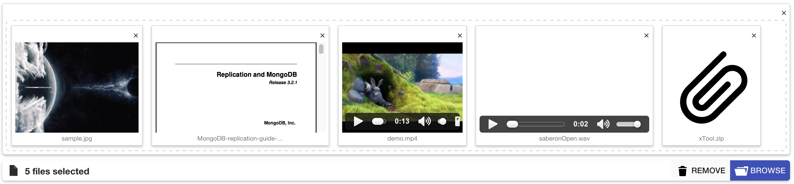
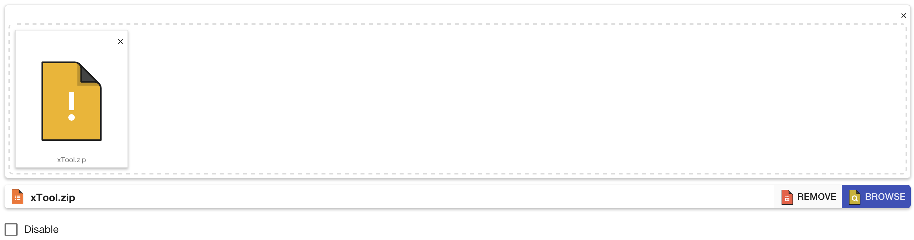

# File Input

A Html file input enhance base on angular material.

This directive try to make input file or file upload intuitive.






## Usage

This directive is focus on make upload file base on ajax.

So the most important thing is you need fetch files yourself from "ng-model" data bind, not input element because it will clear every time after resolve file.

The "ng-file" data is an array of javascript standard file with some custom field:

- media: image, video, audio, object
- isRemote: whether file is remote or from local
- url: the URL of the file (is generated with URL)

Simply, put the directive into your view:

```html
<mb-file-input 
	ng-model='files' 
	multiple>
</mb-file-input>
```

You can watch the model changes in your controller:

```javascript
app.controller('MyCtrl',function($scope){
	$scope.$watch('files.length', function(newVal,oldVal){
		console.log($scope.files);
	});
});
```

Finally you can use files to send into your backend or use in the application directly.

For example the following controller sends data to the backend on the submit button click.

```javascript
app.controller('MyCtrl',function($scope){
	...
	$scope.onSubmit = function(){
		var formData = new FormData();
		angular.forEach($scope.files,function(file){
			if(!obj.isRemote){
				formData.append('files[]', file);
			}
		});
		$http.post('./upload', formData, {
			transformRequest: angular.identity,
			headers: {'Content-Type': undefined}
		}).then(function(result){
			// do sometingh                   
		},function(err){
			// do sometingh
		});
	};
	...
});
```

In this example the node.js( express + formidable ) & ( express + multer ) is used on server side, "Formidable & Multer" is a node module for parsing form data.

#### server

##### Formidable

```javascript

    var express = require('express');
    var formidable = require('formidable');
    var app = express();
    app.use(express.static(__dirname + '/public'));

    ...

    app.post('/upload',function(req,res){
        var form = new formidable.IncomingForm();
        form.uploadDir = __dirname +'/public/uploads';
        //file upload path
        form.parse(req, function(err, fields, files) {
            //you can get fields here
        });
        form.on ('fileBegin', function(name, file){
            file.path = form.uploadDir + "/" + file.name;
            //modify file path
        });
        form.on ('end', function(){
            res.sendStatus(200);
            //when finish all process    
        });
    });

    ...

```

##### Muliter

```javascript

    var express = require('express');
    var multer = require('multer');
    var app = express();
    app.use(express.static(__dirname + '/public'));

    ...

    var storage = multer.diskStorage({
        destination: function (req, file, cb) {
            cb(null, __dirname +'/public/uploads');
            //modify upload dest
        },
        filename: function (req, file, cb) {
            cb(null, file.originalname);
            //modify file name
        }
    });
    var upload = multer({ "storage": storage });
    var type = upload.array('files[]');

    app.post('/upload',type,function(req,res){
        res.sendStatus(200);
    });

    ...

```

### Basic

```html
<mb-file-input
	ng-model="files" 
	ng-change="onFilesChange()">
</mb-file-input>
```

### Submit button

```html
<mb-file-input
	ng-model="files" 
	mb-on-submit-click="onSubmitClick(files)">
</mb-file-input>
```

### Aria-label

```html
<mb-file-input
	ng-model="files" 
	aria-label="fileupload">
</mb-file-input>
```

### Accept

Accept attribute only support MIME type (e.g: image/* , image/jpeg , video/* , video/mp4)

```html
<mb-file-input 
	ng-model="files" 
	mb-accept="image/*">
</mb-file-input>
```

### Multiple

```html
<mb-file-input 
	ng-model="files" 
	mb-multiple>
</mb-file-input>
```

### Progress

```html
<mb-file-input 
	ng-model="files" 
	mb-progress>
</mb-file-input>
```

### Placeholder

```html
<mb-file-input 
	ng-model="files" 
	mb-placeholder="my placeholder">
</mb-file-input>
```

### Caption

```html
<mb-file-input 
	ng-model="files" 
	mb-caption="my caption">
</mb-file-input>
```

### Preview

```html
<mb-file-input 
	ng-model="files" 
	mb-preview>
</mb-file-input>
```

### Drag

```html
<mb-file-input
	ng-model="files" 
	mb-drag>
</mb-file-input>
```

### Change labels

```html
<mb-file-input 
	ng-model="files" 
	mb-drag-and-drop-label="Drag and Drop this" 
	mb-drag>
</mb-file-input>
```

```html
<mb-file-input 
	ng-model="files"
	mb-browse-label="Browse...">
</mb-file-input>
```

```html
<mb-file-input 
	ng-model="files" 
	mb-remove-label="Trash">
</mb-file-input>
```

NOTE: mb-translateion is used internally to support locals.

### Reset internal lfFiles

```html
<mb-file-input 
	ng-model="files" 
	mb-drag 
	mb-api="fileApi">
</mb-file-input>
```

Corresponding javascript controller

```javascript
/**
 * Upload using your own API
 */
upload().then(function(response)
{
    /**
     * Do stuff
     * ...
     */
     /**
      * Reset the contents of file input
      */
     $scope.fileApi.removeAll();
});
```


### Validation

| Attribute      | Description            |
| :------------- | :--------------------- |
| mb-required    | file input required    |
| mb-file-max    | files count limit      |
| mb-file-min    | files count limit      |
| mb-file-size    | per file size limit    |
| mb-file-size-total   | total files size limit |
| mb-file-mimetype    | mime type check        |

mb-file-size and mb-file-size-total must require number with unit. (e.g: 5Byte, 100KB, 5MB)

```html
<form 
	name="testForm" 
	layout="column">
	<mb-file-input 
		name="files" 
		ng-model="files" 
		mb-required 
		mb-file-max="5" 
		mb-file-size="10MB" 
		mb-file-size-totoal="20MB" 
		mb-file-mimetype="image/*" 
		mb-multiple 
		mb-drag 
		mb-preview>
	</mb-file-input>
	<div ng-messages="testForm.files.$error" style="color:red;">
		<div ng-message="required">This is required.</div>
		<div ng-message="maxcount">Too many files.</div>
		<div ng-message="filesize">File size too large.</div>
		<div ng-message="totalsize">Total size too large.</div>
		<div ng-message="mimetype">Mimetype error.</div>
	</div>
</form>

```

### Function binding

By setting an AngularJS expression to the following attributes, they will be evaluated on
related events.

| Name               | Locals            | Description               |
| :----------------- | :---------------- | :------------------------ |
| mb-on-file-click   | $file, $index     | When click specific file  |
| mb-on-file-remove  | $file, $index     | Remove all file           |
| mb-on-submit-click | -                 | When submit button click  |


```html
<mb-file-input 
	ng-model="files" 
	mb-submit
	mb-on-file-click="onFileClick(files, $file, $index)" 
	mb-on-file-remove="onFileRemove(files, $file, $index)" 
	mb-on-submit-click="onSubmitClick(files)">
</mb-file-input>
```

```javascript
    ...
	$scope.onFileClick = function(files, file, idx){
		console.log(file);
	};
	$scope.onFileRemove = function(files, file, idx){
		console.log(file);
	};
	$scope.onSubmitClick = function(files) {
		console.log(files);
	}
```

### API

| Name           | Parameter   | Description |
| :------------- | :---------- | :--------------------|
| removeByName   |  name(string)    | Remove file by name  |
| removeAll      |                  | Remove all file      |
| addRemoteFile  | url(string), name(string), type(string) | Add remote url file for preview  |

```html
<mb-file-input 
	ng-model="files"
	mb-api="api">
</mb-file-input>
<mb-button 
	class="mb-raised mb-warn" 
	ng-click="api.removeAll()">
	<mb-icon>clear</mb-icon>
</mb-button>
```

```javascript
	$scope.api.addRemoteFile('../example/resources/sample.jpg','sample.jpg','image');
```

Currently addRemoteFile only support 4 types include "image"、"video"、"audio" and "other".

The file add by addRemoteFile API will also exist in lf-files array but with a property isRemote:true, so when you upload files, you should do one more job to check the isRemote is true or false, if true then should ignore it.

